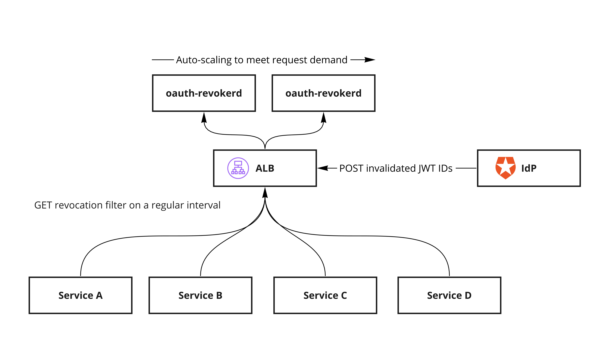

# oauth-revokerd

A scalable token revocation service with built-in distributed database and bloom filter generation for probabilistic lookup by distributed nodes.

## Problem statement

Distributed systems can reduce backpressure introduced by token validation by utilising signed JWTs. These JWTs last for a period of time (typically 10 minutes to 1 hour) and once expired cease to operate. For scenarios where tokens need to be revoked each system must be aware of the list of revoked tokens — this isn't ideal because then each system might need to make a network request back to the Identity Provider which brings us back to square one — unless you can produce a distributed bloom filter that could allow probabilistic checking of the JWT ID before deciding whether or not to perform the lookup.

## Implementation

OAuth-Revokerd is an auto-scaling service meant to be deployed in Amazon ECS (or similar). Internally, it maintains an in-memory database, peer auto-discovery and a REST API used invalidate tokens and download the compiled bloom filter.

## Accompanying write-up

https://notes.willhackett.com/distributed-token-invalidation/
